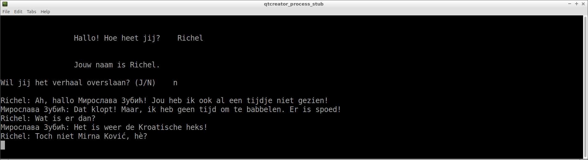

# srbija

Branch|
---|---
master|
develop|

`srbija` is een tekstgebaseerd vechtspel waarin jij Servië moet redden van de Kroatische heks Mirna Ković.

`srbija` is geprogrammeerd door Mark Wiering. Om de code op Travis CI te laten compilen, heeft Richel Bilderbeek wat kleine aanpassingen gedaan.